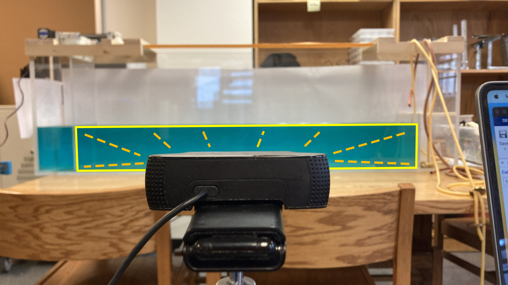

# Shoreline Wave Analysis & Generator Control

## 🌊 Project Overview

This repository houses the software suite developed for the **NSF Urban Shorelines Reconfiguration Research** project. The system is designed to simulate, track, and analyze ocean waves in a physical tank to optimize seawall architectures for coastal protection (specifically for NYC shorelines).

The project consists of three main pillars:
1.  **Computer Vision Analysis (MATLAB):** Automated edge detection and tracking of wave amplitude and velocity.
2.  **Hardware Control (Python/Arduino):** Wireless and manual control of the wave generation apparatus.
3.  **TPMS Optimization:** The design and testing of Triply Periodic Minimal Surfaces as novel shoreline protection.

## 🏗️ Physical Engineering & TPMS

This software controls a custom-built **six-foot physical wave tank**, engineered to simulate realistic ocean conditions using high-torque stepper motors.

### TPMS Seawall Design
A core focus of this research is the optimization of **Triply Periodic Minimal Surfaces (TPMS)** for shoreline protection. TPMS are complex, naturally occurring mathematical geometries that divide space with minimal surface area. 
* **The Goal:** We utilized these geometries to design porous, structurally efficient seawalls.
* **Optimization:** By iterating on the TPMS parameters, we aimed to find the optimal geometry that maximizes wave energy dissipation while using minimal material.

### Hardware-Software Integration
The setup requires precise calibration between the physical generator and the analysis software to ensure accurate environmental modeling. The `WaveGeneratorApp` drives the physical motors to create specific wave frequencies, allowing us to test how different TPMS designs perform under varying wave conditions.

### STEM Workshop Mentorship
This research served as a foundation for the [ERHS STEM Workshop](https://sites.google.com/schools.nyc.gov/erhsstemworkshop/stem-workshop?authuser=0). A dedicated session was led to mentor students on:
* **CAD & Fabrication:** Teaching students how to design and fabricate their own seawall prototypes.
* **Experimental Design:** Demonstrating how computer vision can quantify the energy dissipation of student-designed structures compared to the TPMS models.

## 📸 Experimental Setup

The data acquisition setup is designed to capture high-fidelity wave mechanics without interfering with the fluid dynamics.

* **Wave Tank:** A 6-foot custom acrylic tank featuring a stepper-motor-driven paddle for precise frequency generation.
* **Imaging:** A high-resolution camera is mounted parallel to the tank's cross-section. It captures the wave profile against a high-contrast background, allowing the computer vision algorithms to "see" the water-air interface.
* **Lighting:** Controlled lighting conditions ensure the HSV thresholding (used in `createMask.m`) operates consistently across different test runs.

## 📂 Repository Structure

### 1. Wave Analysis (MATLAB)
Located in the root and app directories, these tools handle the data processing pipeline.
* **`WaveTankAnalyzer.mlapp`**: The primary GUI application for importing video feeds and visualizing results.
* **`WaveTankFunction.m`**: The core backend function containing the mathematical logic for processing wave data and calculating metrics.
* **`createMask.m` / `createMask2.m`**: Auto-generated functions using HSV color space thresholding to mask the water against the tank background.
* **`CurveFittingTool.sfit`**: Saved sessions for fitting wave data to theoretical models.

### 2. Hardware Control (Python & Arduino)
Tools for communicating with the physical wave generator hardware.

**Arduino Firmware:**
* **`BlueTooth.ino`**: Establishes a BLE (Bluetooth Low Energy) peripheral service to expose control characteristics.
* **`switch.ino` / `switchdeploy.ino`**: Firmware for standalone operation using physical limit switches to safe-guard the motor assembly.

**Python & Serial Control:**
* **`bluetooth_bleak.py`**: A cross-platform Python script using the `bleak` library to discover and communicate with the Arduino.
* **`WaveGeneratorApp_serial.mlapp`**: A MATLAB interface for sending direct serial commands to the wave generator motor drivers.

## 🚀 Getting Started

### Prerequisites
* **MATLAB**: R2022a+ (Image Processing & Curve Fitting Toolboxes).
* **Python 3.x**: `pip install bleak pygatt bluepy tk`.
* **Hardware**: Arduino Nano 33 BLE Sense / Nano RP2040 Connect & Stepper Motor setup.

### Usage

#### Running the Analysis
1.  Open MATLAB and run `WaveTankAnalyzer.mlapp`.
2.  Import your experimental video file.
3.  The app calls `WaveTankFunction.m` to isolate the wave edge and calculate velocity/amplitude metrics.

#### Controlling the Hardware
* **Via Bluetooth:** Upload `BlueTooth.ino` and run `python bluetooth_bleak.py` to toggle hardware states.
* **Via Physical Switch:** Upload `switchdeploy.ino` for standalone manual control in the lab.

## 👥 Contributors

* **Daniel Halpern** - *Developer*
  * Computer Vision Pipeline, MATLAB App Architecture, Curve Fitting Tools, and Data Analysis Algorithms.
* **Ryan Zhang** - *Developer*
  * MQTT Protocol Integration, Stepper Motor Control Logic, and Python/GUI Backend Structure.
* **Michael Wen** - *Developer*
  * Arduino Firmware Development, Switch/Limit Logic Implementation, and MQTT TUI.
* **Gavin Brady** - *Developer*
  * UI/UX Interface Optimization, Input Control Systems, and Wave Maker Speed Adjustments.
* **Chin-Sung Lin** - *Research Advisor*
  * Project Mentorship, Experimental Oversight, and Faculty Guidance.

## 📄 License

This project is open-source and available under the MIT License.

---
*Developed by ELROSTEM at Eleanor Roosevelt High School.*